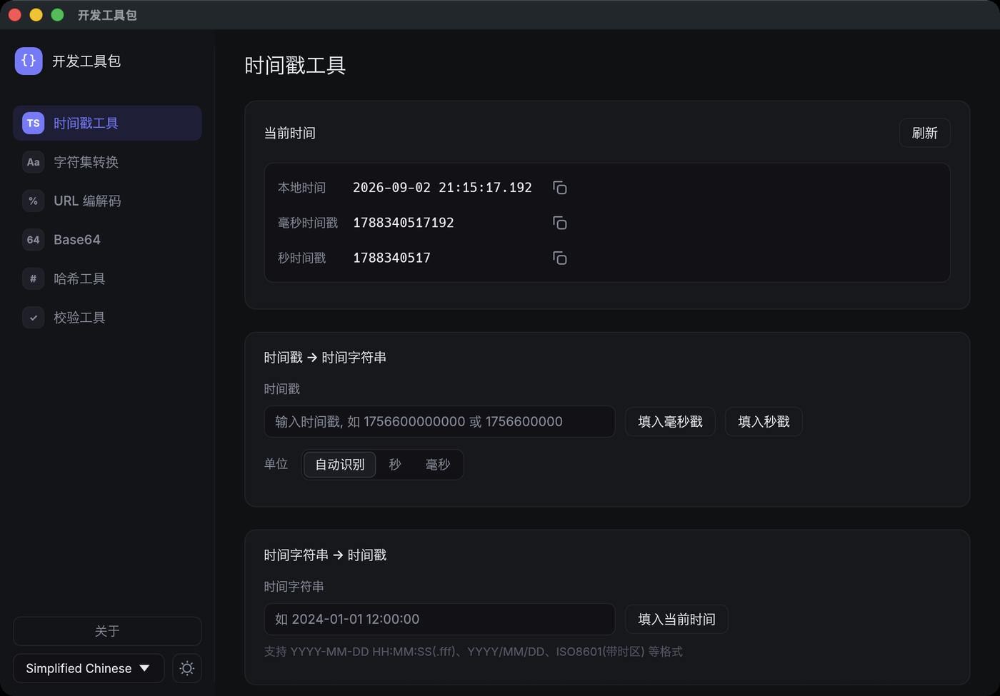
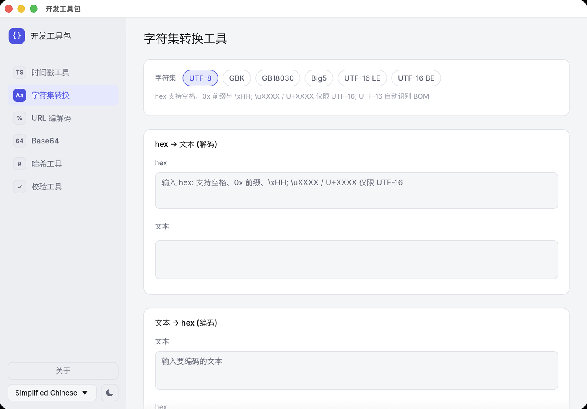
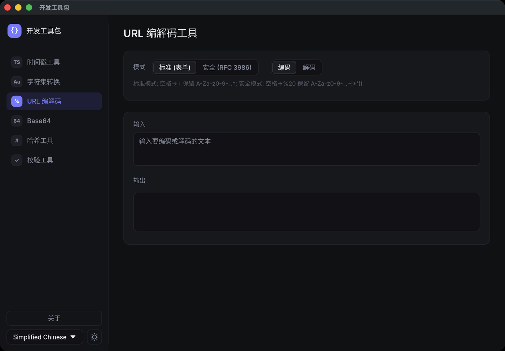
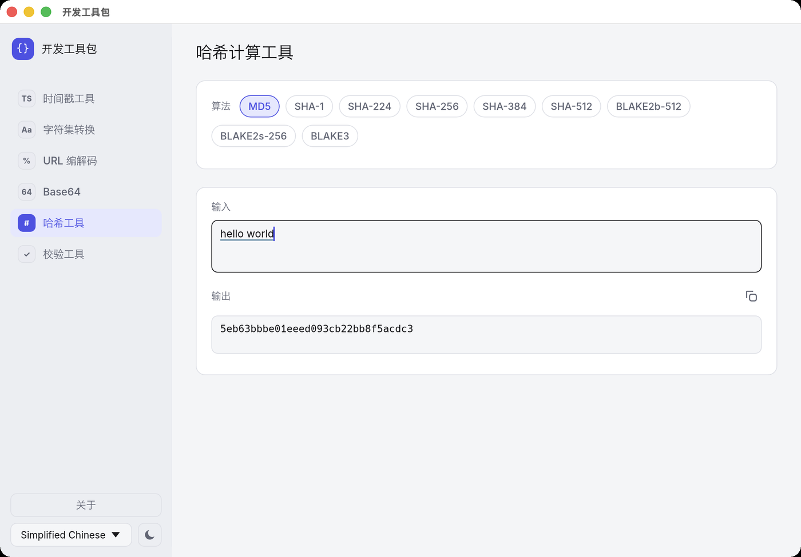
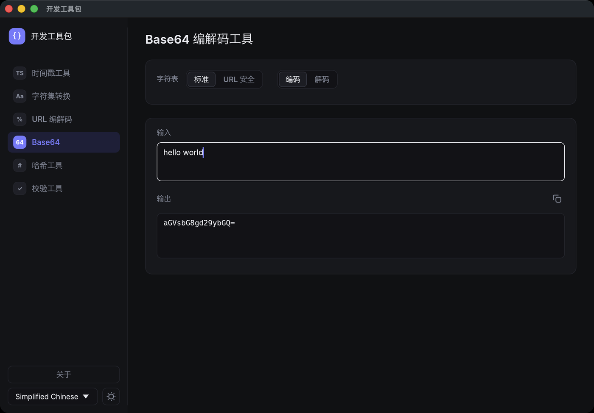
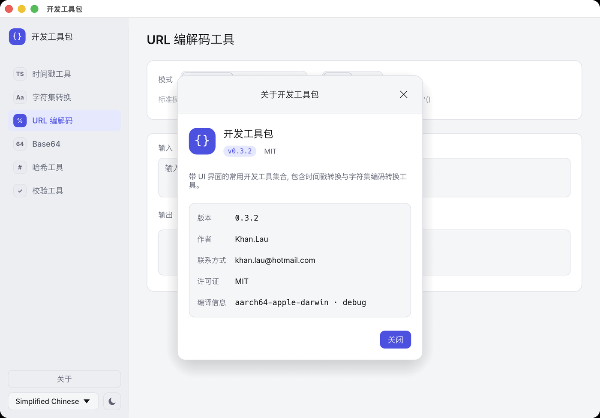

# 开发工具包

带 UI 界面的开发工具集合, 纯 Rust + egui 实现, 跨平台 (Windows / Linux / macOS), 不依赖 C/C++ 代码。

## 界面预览

| 时间戳工具 (深色) | 字符集转换 (浅色) |
| --- | --- |
|  |  |

| URL 编解码 (深色) | 哈希计算 (浅色) |
| --- | --- |
|  |  |

| Base64 编解码 (深色) | 关于窗口 (浅色) |
| --- | --- |
|  |  |

## 功能

1. 时间戳与时间格式化工具
   - 时间戳(秒 / 毫秒) ↔ 时间字符串 双向转换, 自动识别单位
   - 当前时间实时刷新(每秒定时更新)
2. 字符集编码转换工具 (UTF-8 / GBK / GB18030 / Big5 / UTF-16 LE / UTF-16 BE)
   - hex 字符串 解码为指定字符集
   - 指定字符集 编码为 hex 字符串
   - hex 解码输入支持格式: 连续 hex / 空白分隔 / `0x` 前缀 (可多处重复) / `\xHH` 字节转义
   - Unicode 码点表达式 `\uXXXX` (定长4位)、`\u{...}`、`U+XXXX` 仅限 UTF-16 字符集下生效
   - hex 解码时自动猜测编码: 基于 chardetng 启发式检测, 并列出所有可无损解码的候选编码
3. URL 编码与解码工具 (标准表单 / RFC 3986 安全模式)
4. Base64 编码与解码工具 (标准字符表 / URL 安全字符表)
5. 哈希计算工具 (MD5 / SHA-1 / SHA-224 / SHA-256 / SHA-384 / SHA-512 / BLAKE2b-512 / BLAKE2s-256 / BLAKE3)
6. 校验计算工具 (CRC-8 / CRC-16 IBM / CRC-16 MODBUS / CRC-32 / CRC-32C / CRC-64 / BCC / LRC / SUM-8 / HMAC-MD5 / HMAC-SHA1 / HMAC-SHA256 / HMAC-SHA512)
   - HMAC 算法需输入密钥 (Key), 其余算法无需密钥
7. HTTP 请求工具 (类 Postman)
   - 方法 (GET/POST/PUT/PATCH/DELETE/HEAD/OPTIONS) + URL, 回车即发送
   - 自定义请求头 (增删行, 发送前做合法性校验)
   - 请求体四种模式, Content-Type 自动设置并实时显示在界面上:
     - 无
     - URL 编码 (`application/x-www-form-urlencoded; charset=utf-8`)
     - Form-Data (`multipart/form-data; charset=utf-8; boundary=…` boundary 自动生成, 值以 `@` 开头表示发送文件)
     - 原文 (Content-Type 可选 文本 / JSON / XML / HTML, 均显式声明 `charset=utf-8`)
   - 响应: 状态码 / 耗时 / 大小 / 响应头 / 响应体
     (按 Content-Type charset 解码, 缺省 UTF-8; JSON 可一键格式化)
   - 请求在后台线程执行, 不阻塞界面; 会话内历史记录一键还原

## 特性

- 现代化界面: 左侧导航栏 + 卡片式内容区, 深色 / 浅色主题(默认跟随系统, 可手动切换)
- 内置 [Inter](https://rsms.me/inter/) 可变字体渲染拉丁字母与数字, 中文等 CJK 文字回退到系统字体
  (macOS 冬青黑体/苹方, Windows 微软雅黑, Linux Noto Sans CJK), 并自动解析字体度量对齐基线,
  中英文混排不再上下错位
- 输入框支持复制粘贴, 结果一键复制(带复制成功反馈)
- 国际化: 简体中文 / 繁体中文 / English / 日本語
- 语言文案存放于可执行文件同目录 `langs/*.json`, 无需改代码即可自行翻译或新增语言
- Windows 二进制自动嵌入应用图标 (amd64 / arm64)

## 编译

### 环境要求

- Rust 工具链
- [zig](https://ziglang.org/) + [cargo-zigbuild](https://github.com/rust-cross/cargo-zigbuild) (交叉编译用)
- 安装交叉编译目标 (以 aarch64 Windows 为例):

```bash
  $env:RUSTUP_DIST_SERVER="https://rsproxy.cn"; $env:RUSTUP_UPDATE_ROOT="https://rsproxy.cn/rustup"
  rustup target add aarch64-pc-windows-gnullvm # 安装aarch64架构的Windows目标
```

### 命令

```bash
  cargo run --release                           # 本机运行
  cargo build --release                         # 本机发布构建

  # 交叉编译命令, 依赖 cargo-zigbuild插件和 zig 编译器 以及安装的交叉编译目标
  cargo zigbuild --release --target x86_64-pc-windows-gnu       # Windows x86_64 架构
  cargo zigbuild --release --target aarch64-pc-windows-gnullvm  # Windows aarch64 架构
  cargo zigbuild --release --target x86_64-unknown-linux-musl   # Linux x86_64 架构
  cargo zigbuild --release --target aarch64-unknown-linux-musl  # Linux aarch64 架构
  cargo zigbuild --release --target x86_64-apple-darwin         # macOS Intel 架构
  cargo zigbuild --release --target aarch64-apple-darwin        # macOS Apple Silicon 架构
  cargo zigbuild --release --target universal2-apple-darwin     # macOS Universal mach-o fat 架构
```

### macOS 安装包

```bash
  scripts/package-macos.sh                                  # 通用二进制 (Apple Silicon + Intel)
  ARCHS="aarch64-apple-darwin" scripts/package-macos.sh     # 仅 Apple Silicon
  SIGN_IDENTITY="Developer ID Application: ..." scripts/package-macos.sh   # 用正式证书签名
```

脚本只依赖 macOS 自带的 `lipo` / `codesign` / `hdiutil`, 产物位于 `dist/`:
`DevToolkit.app` 与 `DevToolkit-<version>-macos.dmg`。默认为 ad-hoc 签名,
未经公证, 首次打开需按下文"运行"一节放行。

### 语言文件

程序首次运行会在可执行文件同目录生成 `langs/` 并导出内置语言文件 (如 `zh-CN.json`),
编辑 JSON 即可修改文案, 新增 JSON 文件 (如 `de.json`) 会作为新语言出现在界面中。
升级后旧语言文件中缺失的字段自动使用内置翻译补齐, 无需手动更新;
自行翻译过的字段始终保留。
macOS 上以 `.app` 运行时, 该目录位于 `~/Library/Application Support/devToolkit/langs`
(bundle 内部受签名保护, 不可写入)。

## 运行

* MacOS 由于安全性问题, 需要手动添加应用到系统信任列表 (System Preferences -> Security & Privacy -> General -> Open where downloaded apps). 添加后即可运行。
* 若添加后仍旧不可运行, 需要手工执行 `sudo xattr -n com.apple.quarantine -rd <path_to_executable>` 来移除 quarantine 属性。
